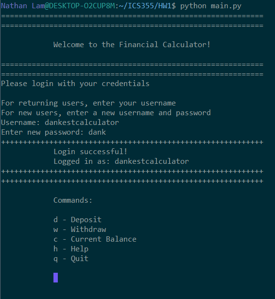
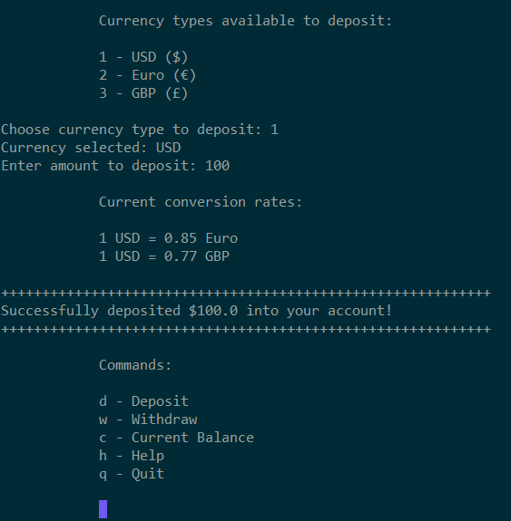
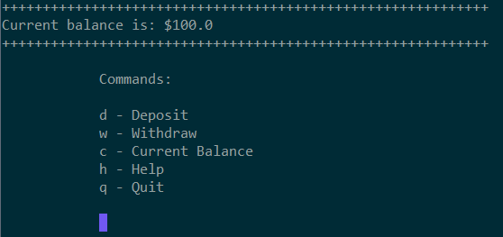

# Financial Calculator
The financial calculator keeps track of users, passwords, and the current balance. After logging into the application, available options are deposit, withdraw, view current balance, help, and quit. The program uses regex to validate the input which will reject the user if invalid input is provided. The information for each user is stored in a .csv file.

# Dependencies 
To run the application, you may need to install re, numbers, csv, and os. The application was built using Python 3.6.1 but should work for any version of Python 3.X.X.A

To install dependencies: 
```
sudo apt-get install [package]
```

# Developers Guide
Run the application with:
```
python main.py
```

# Usage
For first time users, enter a new username and password. For returning users, the information is stored in the database and verifies password credentials. After logging in, the user can deposit, withdraw, or view current balance. To deposit, choose currency type (USD, Euro, or GBP) then enter the amount to deposit. The conversion will be done automatically in the background. Similarly, to withdraw currency, select the currency type and enter the amount to withdraw. The user can also view the current balance in the account. Regex will validate currency inputs so it will keep retrying until correct input is given. 

# Examples
Credential Login


Deposit


Current Balance

